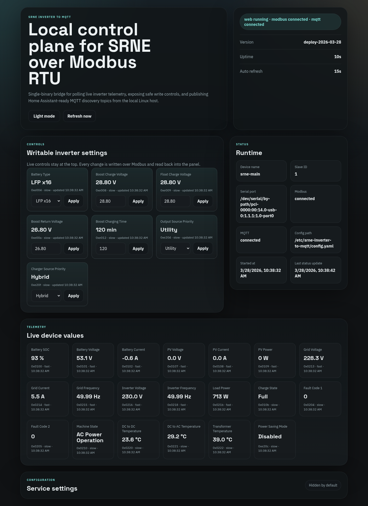
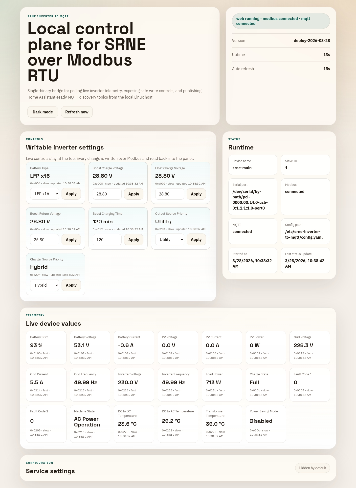
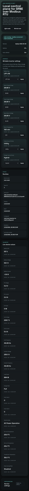

# SRNE Inverter to MQTT

Linux-first single-binary bridge for polling an SRNE inverter over local Modbus RTU and publishing live telemetry and writable settings to Home Assistant over MQTT.

## Highlights

- single Go binary with embedded web UI,
- YAML-backed configuration with no external database,
- local Modbus RTU polling over USB serial,
- Home Assistant MQTT Discovery for telemetry and writable controls,
- built-in control panel with live telemetry, safe writes, and serial port discovery,
- GitHub Actions workflows for CI and tagged releases on Linux.

## Screenshots

### Dark mode



### Light mode



### Mobile layout



## What it does

The service runs next to the inverter, talks to it over Modbus RTU, and removes the need for unstable USB-over-IP serial forwarding into Home Assistant.

Current scope:

- polls a practical SRNE MVP register set,
- exposes writable inverter settings through the web panel,
- publishes telemetry to MQTT state topics,
- publishes Home Assistant Discovery for both read-only sensors and writable `select` / `number` controls,
- keeps everything in a single deployable binary plus one YAML config file.

## Quick start

Run locally with the example config:

```bash
go run ./cmd/srne-inverter-to-mqtt --config ./configs/config.example.yaml
```

The service creates a default YAML config if the target file does not exist.

By default the embedded web panel listens on `http://127.0.0.1:8080`.

## Configuration

See [`configs/config.example.yaml`](configs/config.example.yaml).

On Linux, prefer stable serial symlinks from `/dev/serial/by-path/` or `/dev/serial/by-id/` instead of raw `/dev/ttyUSB*` names whenever possible.

Deployment details and a ready-to-use `systemd` unit are documented in [`docs/DEPLOYMENT.md`](docs/DEPLOYMENT.md).

## HTTP API

- `GET /healthz`
- `GET /api/v1/status`
- `GET /api/v1/config`
- `PUT /api/v1/config`
- `GET /api/v1/serial/ports`
- `POST /api/v1/registers/{id}/write`

`/api/v1/status` returns runtime service state and the latest telemetry snapshot used by both the web panel and MQTT publishing.

## Home Assistant integration

Writable settings are exposed to Home Assistant as MQTT Discovery controls:

- enum registers are published as `select`,
- numeric writable registers are published as `number`,
- read-only values stay as regular `sensor` entities.

This makes settings such as output source priority or charger source priority writable both from the built-in web panel and directly from Home Assistant.

## Credits

Thanks to the community members and open-source projects that helped establish the protocol and register groundwork used during this implementation:

- Home Assistant community discussion: <https://community.home-assistant.io/t/integrating-srne-mppt-inverter-with-ha/490475/103?page=4>
- `cole8888/SRNE-Solar-Charge-Controller-Monitor`: <https://github.com/cole8888/SRNE-Solar-Charge-Controller-Monitor>
- `SeByDocKy/myESPhome`: <https://github.com/SeByDocKy/myESPhome>
- `SRNE_MODBUS Protocol V3.9` document referenced through the ESPHome repository

## Release workflow

GitHub Actions includes:

- CI workflow for build and test,
- tagged release workflow for Linux artifacts.

Create a release by pushing a tag like:

```bash
git tag v0.1.0
git push origin v0.1.0
```

The release workflow builds Linux archives and publishes checksums as GitHub release assets.

Use [`docs/RELEASE_CHECKLIST.md`](docs/RELEASE_CHECKLIST.md) as the final pre-tag checklist.

## License

Apache-2.0. See [`LICENSE`](LICENSE).
