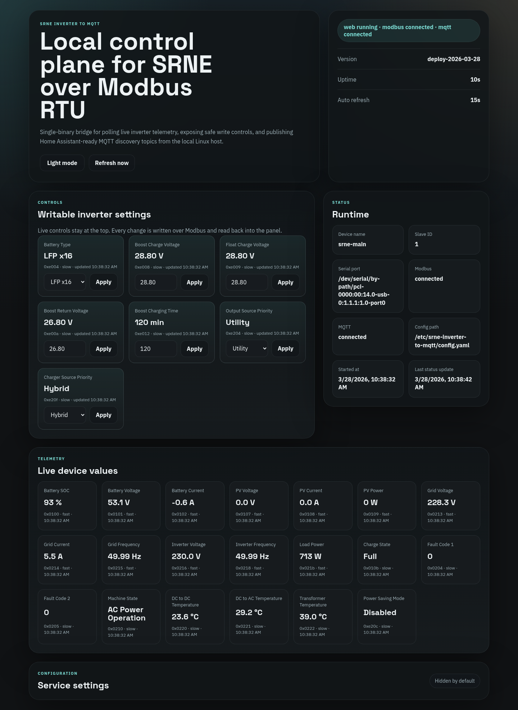
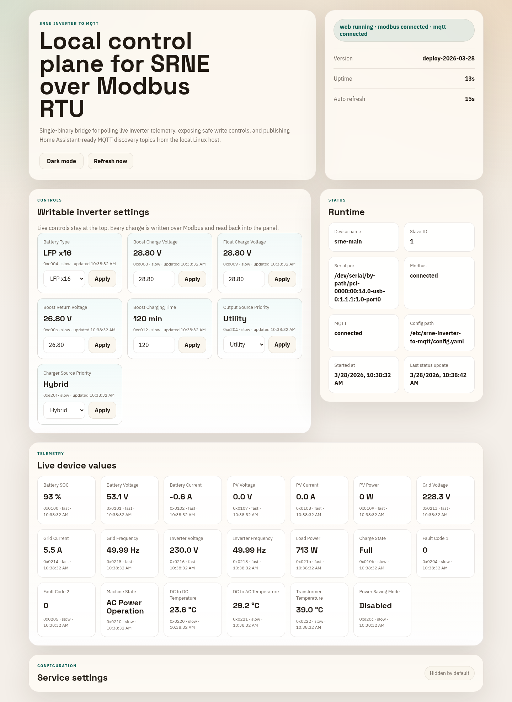
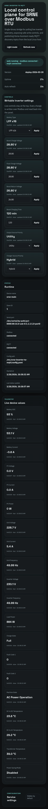

# SRNE Inverter to MQTT

[](https://github.com/SPDG/srne-inverter-to-mqtt/actions/workflows/ci.yml)
[](https://github.com/SPDG/srne-inverter-to-mqtt/actions/workflows/release.yml)

Linux-first single-binary bridge for polling SRNE inverters over Modbus RTU or TCP and publishing live telemetry and writable settings to Home Assistant over MQTT.

## Highlights

- single Go binary with embedded web UI,
- YAML-backed configuration with no external database,
- Modbus RTU, transparent RTU-over-TCP, and Modbus TCP gateway transports,
- model-aware single-phase, SPI H3P, and HESP SH3 inverter profiles,
- Home Assistant MQTT Discovery for telemetry and writable controls,
- managed storm charging with target SOC, current limit, timeout, rollback, and manual cancellation,
- built-in control panel with live telemetry, searchable Modbus data with computed-value labelling, safe writes, inverter clock setting, and serial port discovery,
- GitHub Actions workflows for CI and tagged releases on Linux.

## Screenshots

### Dark mode



### Light mode



### Mobile layout



## What it does

The service can run next to the inverter over local USB serial or connect to a serial-to-Ethernet gateway. It removes the need for USB-over-IP forwarding into Home Assistant.

Current scope:

- polls profile-specific SRNE register sets, including per-phase and dual-PV telemetry on supported three-phase models,
- exposes writable inverter settings through the web panel,
- publishes telemetry to MQTT state topics,
- publishes Home Assistant Discovery for both read-only sensors and writable `select` / `number` controls,
- keeps everything in a single deployable binary plus one user-managed YAML config file.

## Quick start

Run locally with the example config:

```bash
go run ./cmd/srne-inverter-to-mqtt --config ./configs/config.example.yaml
```

The service creates a default YAML config if the target file does not exist.

By default the embedded web panel listens on `http://127.0.0.1:8080`.

## Configuration

See [`configs/config.example.yaml`](configs/config.example.yaml).

On Linux, prefer stable serial symlinks from `/dev/serial/by-path/` or `/dev/serial/by-id/` instead of raw `/dev/ttyUSB*` names whenever possible.

Serial-over-Ethernet converters are supported by setting `serial.port` to a TCP endpoint such as `tcp://192.168.6.50:502`. Use `serial.network_protocol: rtu_over_tcp` for transparent serial servers, or `serial.network_protocol: modbus_tcp` when the converter is configured as a Modbus TCP gateway.

Select the hardware profile explicitly:

- `single_phase` for the original single-phase register map,
- `spi_h3p` for SPI-8K/10K/12K-H3P off-grid three-phase inverters,
- `hesp_sh3` for HESP SH3 hybrid/on-grid three-phase inverters.

The legacy `three_phase` value is accepted as an alias for `spi_h3p`.

Storm charge defaults are configured under `storm_charge`. An active session
temporarily enables the SPI H3P timed utility-charging function, applies the
selected battery-side current limit and target SOC, then restores the exact
previous schedule and settings after reaching the target, timing out, losing
the grid, encountering a fault, or being cancelled manually. Crash recovery
data is written automatically next to the main config as
`<config>.storm-charge-state.yaml`.

The Controls view can read and set the inverter's local wall clock. The panel
uses the browser's local date and time rather than the server timezone, and a
write is always explicit. A correct inverter clock is required for daily
counters and the built-in timed charging schedule.

The probe command uses the same transports, for example:

```bash
go run ./cmd/modbus-probe --port tcp://192.168.6.50:502 --network-protocol rtu_over_tcp --slave 1 --address 0x0100 --count 1
```

Deployment details and a ready-to-use `systemd` unit are documented in [`docs/DEPLOYMENT.md`](docs/DEPLOYMENT.md).

Hardware-specific operating notes and the source manuals are available in
[`docs/SPI_H3P_OPERATION.md`](docs/SPI_H3P_OPERATION.md) and
[`docs/reference/`](docs/reference/).

## HTTP API

- `GET /healthz`
- `GET /api/v1/status`
- `GET /api/v1/config`
- `PUT /api/v1/config`
- `GET /api/v1/serial/ports`
- `POST /api/v1/registers/{id}/write`
- `GET /api/v1/storm-charge`
- `PUT /api/v1/storm-charge/settings`
- `POST /api/v1/storm-charge/start`
- `POST /api/v1/storm-charge/cancel`
- `GET /api/v1/inverter/clock`
- `POST /api/v1/inverter/clock`

`/api/v1/status` returns runtime service state and the latest telemetry snapshot used by both the web panel and MQTT publishing.

## Home Assistant integration

Writable settings are exposed to Home Assistant as MQTT Discovery controls:

- enum registers are published as `select`,
- numeric writable registers are published as `number`,
- read-only values stay as regular `sensor` entities.

This makes settings such as output source priority or charger source priority writable both from the built-in web panel and directly from Home Assistant.

Storm charge adds a Home Assistant `switch`, configurable target SOC, maximum
grid-charge current and timeout `number` entities, plus status, deadline,
remaining-time and estimated-power sensors.

## Credits

Thanks to the community members and open-source projects that helped establish the protocol and register groundwork used during this implementation:

- Home Assistant community discussion: <https://community.home-assistant.io/t/integrating-srne-mppt-inverter-with-ha/490475/103?page=4>
- `cole8888/SRNE-Solar-Charge-Controller-Monitor`: <https://github.com/cole8888/SRNE-Solar-Charge-Controller-Monitor>
- `SeByDocKy/myESPhome`: <https://github.com/SeByDocKy/myESPhome>
- `SRNE_MODBUS Protocol V3.9` document referenced through the ESPHome repository

## Release workflow

GitHub Actions includes:

- CI workflow for build and test,
- tagged release workflow for Linux artifacts.

Create a release by pushing a tag like:

```bash
git tag v0.1.0
git push origin v0.1.0
```

The release workflow builds Linux archives and publishes checksums as GitHub release assets.

Use [`docs/RELEASE_CHECKLIST.md`](docs/RELEASE_CHECKLIST.md) as the final pre-tag checklist.

## License

Apache-2.0. See [`LICENSE`](LICENSE).
